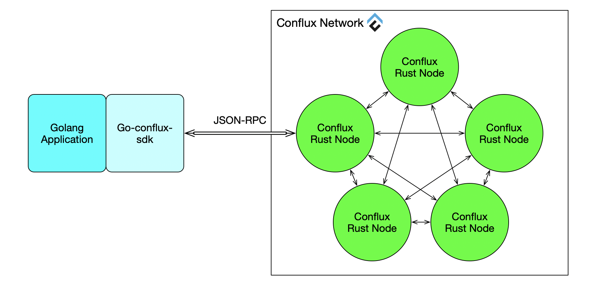

Go-Conflux-SDK
=====

Go-Conflux-SDK is a highly modular, reactive, type safe Golang library for working with Smart Contracts and integrating with clients (nodes) on the Conflux network:

This allows you to work with the [Conflux](https://confluxnetwork.org) blockchain, without the additional overhead of having to write your own integration code for the platform.

Features
========

-   Complete implementation of Conflux's JSON-RPC API over HTTP and Websocket
-   Account manager support
-   Auto-generation of Golang smart contract bindings to create, deploy, transact with and call smart contracts or directly use Go-Conflux-SDK
-   Reactive-functional API for working with filters
-   Support for Internal Contracts